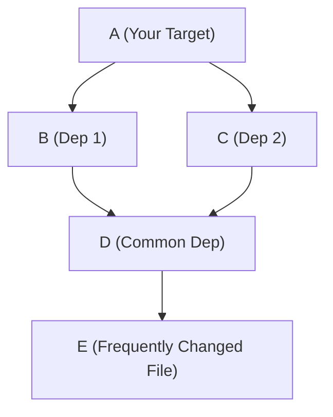
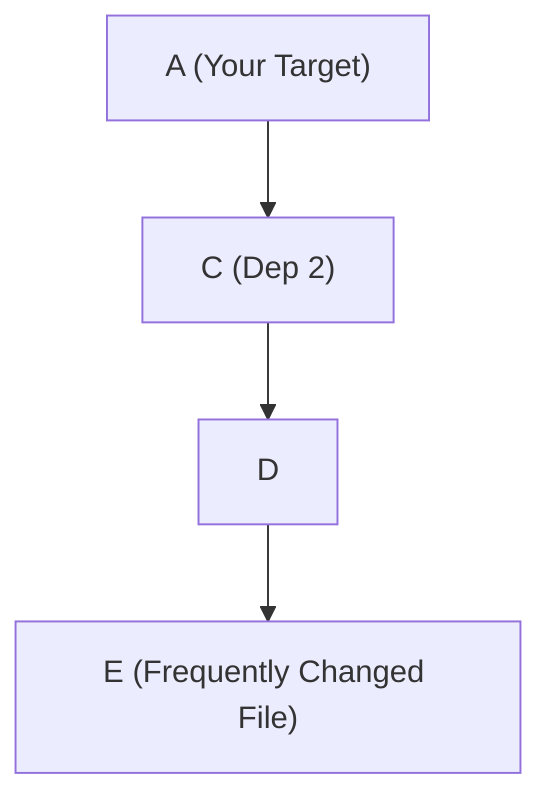

# Find the Highest Impact Dependencies

## Reducing the most triggers of a target

The most effective single dep to remove would be the one that reduces the total
triggers of your target the most.

The *does not necessarily* mean the dependency in the chain that is triggered
the most. This is because, even if that dependency is removed from the chain,
other dependencies may still pull in multiple other targets, which can trigger
your downstream target anyway.

Take, for example:



In this case, removing `B` will still trigger your target frequently,
because `E` is still in the dependency chain:



Therefore, the most effective dep to remove is the one that is triggered the
most by dependencies that are not shared by other dependencies. The algorithm could look like:

```python
def most_unique_triggers(target):
    duplicate_deps = calculate_duplicate_deps(target)
    score_savings_per_dep = defaultdict(int)
    for dep in target:
        unique_deps = d for d in target.deps if d not in duplicate_deps
        total_score = len(union(d.commits for d in unique_deps) | target.files_changed_commits
        score_savings_per_dep[dep] = total_score
    return score_savings_per_dep
```