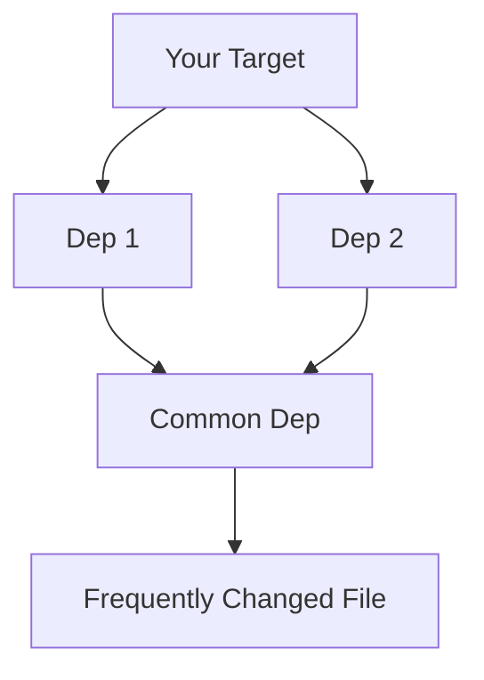

# Find the Highest Impact Dependencies

## Reducing the most triggers of a target

The most effective single dep to remove would be the one that reduces the total
triggers of your target the most.

The *does not necessarily* mean the dependency in the chain that is triggered
the most. This is because, even if that dependency is removed from the chain,
other dependencies may still pull in multiple other targets, which can trigger
your downstream target anyway.

Take, for example:

In this case, removing `Dep 1` will still trigger your target frequently,
because E is still in the dependency chain.

Therefore, the most effective dep to remove is the one that is being triggered
the most frequently, when you subtract triggers from any duplicate upstream
dependencies for your target.